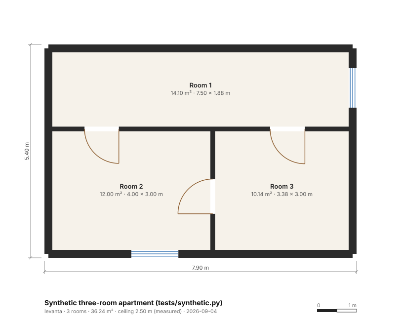

# levanta

**Planos 2D y modelo 3D de una casa a partir de un vídeo grabado con el móvil, o a partir
de datos públicos derivados de satélite.** Librería de Python y herramienta de línea de
comandos. Licencia MIT: conserva el aviso de autoría y es tuya para lo que quieras.

*[English README](README.md)*

```
vídeo del móvil ──▶ fotogramas ──▶ MapAnything ──▶ nube de puntos ──▶ plano ──▶ SVG · DXF · JSON
RGB-D + poses ─────────────────────────────────▶ nube de puntos ──▶ plano ──▶ GLB · OBJ (3D)
lat / lon ──▶ OpenStreetMap / Overture ──▶ huella + altura ──▶ modelo LOD1 + plano de sitio
```

<p align="center">
  
</p>

## Qué hace, sin adornos

| Entrada | Qué obtienes | De dónde sale |
|---|---|---|
| Un **vídeo caminando por la casa** con cualquier móvil | Nube de puntos métrica, paredes con grosor, puertas, ventanas, habitaciones con áreas, altura de techo; plano 2D (SVG, DXF) y modelo 3D (GLB, OBJ) | MapAnything (Meta, 3DV 2026) predice profundidad métrica y cámaras a partir de RGB; `levanta.plan` convierte la nube en arquitectura |
| **Fotogramas RGB-D con poses** (exportaciones de ARCore/ARKit/Record3D, datasets) | Lo mismo, sin GPU | Retroproyección en numpy |
| Una **nube de puntos** en metros (`.ply`) | Plano + modelo | `levanta plan` |
| Una **latitud / longitud** | Huella del edificio, altura, modelo de bloque LOD1, plano de sitio con las longitudes de cada lado | OpenStreetMap (Overpass) u Overture Maps, ambos derivados de imágenes cenitales |

Lo que un satélite **no puede** darte es el interior: ningún sensor ve a través del
techo. Por eso el módulo `site` se detiene en huella + altura, y lo dice en su salida. El
plano interior sale de recorrer la casa con el móvil.

## Instalación

```bash
pip install git+https://github.com/EazyHood/levanta          # núcleo: planos desde nubes / RGB-D, modelos de sitio
pip install "levanta[overture] @ git+https://github.com/EazyHood/levanta"   # + fuente Overture Maps
```

Para la vía del vídeo hace falta además PyTorch con GPU y MapAnything (Apache-2.0):

```bash
pip install torch torchvision --index-url https://download.pytorch.org/whl/cu128   # elige tu CUDA
pip install -r requirements-recon.txt
```

Python 3.10 o superior. Probado en Windows 11 y Ubuntu; el planificador no necesita GPU.

## Uso

```bash
# 1. Un vídeo del móvil -> todo (se eligen los fotogramas más nítidos; con ~30 vistas sobra)
levanta video recorrido.mp4 -o out/casa --max-views 32

# 2. Los pasos por separado
levanta frames recorrido.mp4 -o frames --fps 1
levanta reconstruct frames -o nube.ply --max-views 32       # MapAnything, pesos Apache-2.0 por defecto
levanta plan nube.ply -o out/casa --title "Mi casa"

# 3. RGB-D con poses, sin GPU (demo sobre el benchmark público TUM RGB-D, CC BY 4.0)
levanta tum rgbd_dataset_freiburg1_room -o out/tum

# 4. Datos públicos: el edificio de una coordenada -> modelo LOD1 + plano de sitio
levanta site --lat 4.5981 --lon -74.0760 -o out/sitio           # Bogotá, Plaza de Bolívar
levanta site --lat 4.5981 --lon -74.0760 --source overture --all-buildings

# 5. Reconstruir el modelo 3D desde un plano guardado
levanta model out/casa/plan.json -o casa.glb --ceiling
```

Cada comando escribe un `*_debug.png` con lo que vio el planificador (líneas de visión,
puntos de pared, paredes detectadas, habitaciones). Es lo primero que hay que mirar cuando
un plano sale mal.

Como librería:

```python
from levanta import PointCloud, extract_floor_plan, PlanOptions
from levanta.io.export import export_all

cloud = PointCloud.load_ply("nube.ply")              # metros; usa normales y cámaras si existen
result = extract_floor_plan(cloud, PlanOptions(manhattan=True))
print(result.plan.summary())
export_all(result.plan, "out", stem="plan")          # plan.svg / .dxf / .glb / .obj / .json
```

## Cómo funciona

1. **Reconstrucción** (`levanta.recon`). Los fotogramas RGB-D se retroproyectan con
   normales calculadas sobre la imagen de profundidad (base de 6 píxeles + filtro de
   mediana, porque la profundidad de consumo tiene ruido de centímetros) y orientadas
   hacia la cámara. Para vídeo plano, MapAnything predice en una pasada la profundidad
   métrica, los intrínsecos y las poses de cada vista; esas vistas pasan por el mismo
   código. Cada punto recuerda qué cámara lo vio.
2. **Gravedad** (`levanta.plan.gravity`). El «arriba» medio de las cámaras siembra una
   vertical que se afina con las normales de suelo y techo; un histograma de alturas da
   el suelo y el techo.
3. **Marco Manhattan** (`levanta.plan.walls`). La moda de los ángulos de las normales de
   pared (plegados a 90°) rota la nube para que las paredes vayan por x/y. `--free`
   conserva direcciones arbitrarias.
4. **Rásteres** (`levanta.plan.occupancy`). Por celda de 5 cm, *cuántas bandas de altura*
   contienen puntos de pared: una pared va del suelo al techo, un sofá no. Las líneas de
   visión cámara-punto marcan el espacio libre: un hueco en una pared por el que pasaron
   rayos es una puerta; un hueco que ningún rayo cruzó es pared que nadie miró.
5. **Caras → paredes**. Por dirección, el histograma de desplazamientos da los planos de
   pared; las rachas de puntos a lo largo de cada plano dan caras; una cara vista desde
   la habitación del otro lado se empareja con ella, y eso *mide* el grosor. Las caras
   solitarias reciben un grosor por defecto y se clasifican como exteriores cuando nunca
   se vio nada detrás.
6. **Huecos**. Los vanos con línea de visión son puertas (o pasos si superan 1,3 m), con
   la altura del dintel medida; los bordes de puertas y ventanas se afinan a 1 cm sobre
   las muestras crudas. Ventanas: tramos vistos por debajo y por encima de una banda pero
   nunca dentro de ella.
7. **Habitaciones** (`levanta.plan.rooms`). Se tapian las puertas temporalmente y los
   huecos entre cuerpos de pared son las habitaciones. Si faltan paredes, se puentean
   vanos de hasta 1,2 m; lo que sigue abierto sigue el suelo visto y se marca
   `closed: false`.
8. **3D** (`levanta.plan.model`). Las paredes son cajas partidas alrededor de los huecos
   (cajas de antepecho y dintel, sin booleanas), losas de suelo por habitación, techos
   opcionales; puertas y cristales van como materiales aparte en el GLB.

## Cómo sabemos que funciona

Los tests de `tests/test_pipeline_synthetic.py` construyen apartamentos con verdad
exacta (`tests/synthetic.py`): muestras con ruido de paredes, suelo y techo, muebles
bajos, cámaras que ven a través de las puertas, y una copia inclinada y girada. Los
umbrales de aceptación se escribieron antes de la primera ejecución. Resultados actuales:

| Magnitud | Verdad | Medido | Umbral |
|---|---|---|---|
| IoU de área por habitación (5 habitaciones, 2 escenas) | 1,0 | ≥ 0,999 | ≥ 0,90 |
| Grosor de pared interior | 0,120 m | 0,119 m | ± 0,03 m |
| Ancho de puertas (4) | 0,90 m | 0,87–0,89 m | ± 0,20 m |
| Ancho de ventanas / antepecho / dintel | 1,20 y 1,40 m / 0,90 / 2,10 | 1,19 y 1,39 m / 0,85 / 2,10 | ± 0,20 / ± 0,10 m |
| Altura de techo | 2,50 m | 2,4998 m | ± 0,03 m |
| Residuo Manhattan tras 23° de giro + 9° de inclinación | 0° | < 0,1° | < 1° |

Con datos reales (TUM `freiburg1_room`: una Kinect en mano recorriendo una oficina
llena de mesas, poses de captura de movimiento, 454 fotogramas, sin GPU, 742 k puntos):
aparecen tres paredes, la puerta (0,83 m de ancho, dintel medido a 2,54 m) y el techo
(2,91 m), y la habitación sale de 5,0 × 5,0 m, 19,7 m². La cuarta pared es de cristal y
nunca devolvió profundidad, así que por ese lado el contorno sigue el suelo visto y la
habitación se informa como `closed: false`; ninguna pared se vio por las dos caras, así
que todos los grosores son valores por defecto (`sides_seen: 1`). Plano, imagen de
diagnóstico y JSON en [`examples/tum_fr1_room/`](examples/tum_fr1_room/).

MapAnything sobre la misma secuencia **solo con RGB** (16 fotogramas de 640×480,
portátil con RTX 5060 de 8 GB, 6,7 GB de VRAM, 46 s con el checkpoint de 4,6 GB ya en
caché), comparado píxel a píxel con la profundidad de la Kinect:

| Entradas a la red | mediana profundidad predicha / Kinect | error abs-rel de profundidad | cociente de pasos de cámara |
|---|---|---|---|
| solo imágenes | 0,86 | 0,14 | 0,97 |
| imágenes + intrínsecos conocidos | **0,93** | **0,095** | 0,97 |

Es decir, la escala desde vídeo a secas se queda corta un 7–14 %: pasa los intrínsecos
cuando los tengas (focal del EXIF, ARCore/ARKit) o mide una puerta y reescala. Dieciséis
fotogramas de una Kinect a 640×480 son un caso duro para el planificador (salieron dos
paredes y una habitación abierta); la entrada prevista es un móvil a 1080p con más de
30 fotogramas.

## Límites que conviene saber

- **La escala desde vídeo vale lo que vale la estimación métrica de la red.** Pasa
  intrínsecos o una longitud conocida. RGB-D con poses del dispositivo (ARCore/ARKit) es
  exacto.
- **Un mueble alto parece una pared.** Armarios, neveras y hojas de puerta abiertas
  llegan lo bastante alto como para pasar la prueba de cobertura en altura. Escanea con
  las puertas cerradas y mira el PNG de diagnóstico.
- **Lo no visto es desconocido.** El grosor se mide solo donde se escanearon las dos
  caras; si no, se usa un valor por defecto y la pared queda como `sides_seen: 1`. Las
  paredes exteriores se suponen exteriores cuando nunca se vio nada detrás.
- **El modo Manhattan** ajusta las paredes a dos direcciones; usa `--free` para paredes
  en ángulo.
- **Los modelos de sitio son LOD1**: huella × altura. La altura sale de la etiqueta
  `height` de la fuente si existe, si no de `plantas × 3 m`, si no 3 m, y el JSON dice
  cuál de las tres.
- Cristales, espejos y paredes sin textura son difíciles para cualquier fotogrametría; se
  marcan como no vistos en vez de inventarse.

## Datos y licencias usados

- [MapAnything](https://github.com/facebookresearch/map-anything): código Apache-2.0; el
  checkpoint por defecto `facebook/map-anything-apache` también es Apache-2.0.
- [TUM RGB-D benchmark](https://cvg.cit.tum.de/data/datasets/rgbd-dataset): CC BY 4.0
  (Sturm et al., IROS 2012). No se redistribuye; `levanta tum` lee una secuencia
  descargada.
- [OpenStreetMap](https://www.openstreetmap.org) vía Overpass: ODbL 1.0,
  © colaboradores de OpenStreetMap. [Overture Maps](https://overturemaps.org): ODbL /
  CDLA-Permissive-2.0 según la fuente.

## Estructura

```
src/levanta/
  scene.py          Camera, Frame, PointCloud (PLY con cámaras)
  geometry.py       ayudas numéricas
  io/               fotogramas de vídeo, lector TUM, escritores SVG/DXF/GLB/OBJ/JSON
  recon/            retroproyección RGB-D, adaptador MapAnything, registro de backends
  plan/             gravedad, rásteres, paredes, habitaciones y huecos, pipeline, modelo 3D, PNG de diagnóstico
  site/             proyección WGS84, fuentes OSM/Overture, modelo LOD1 + plano de sitio
  cli.py            el comando `levanta`
tests/              escenas sintéticas con verdad exacta y tests unitarios (sin GPU ni red)
examples/           salidas que se pueden abrir sin ejecutar nada
```

## Licencia y autoría

MIT, ver [LICENSE](LICENSE). Copyright (c) 2026 Jhona (github.com/EazyHood). Puedes usar,
copiar, modificar y redistribuir este software, con o sin fines comerciales, siempre que el
aviso de copyright y el permiso viajen con él. Si publicas trabajo basado en él, se
agradece la cita ([CITATION.cff](CITATION.cff)).
