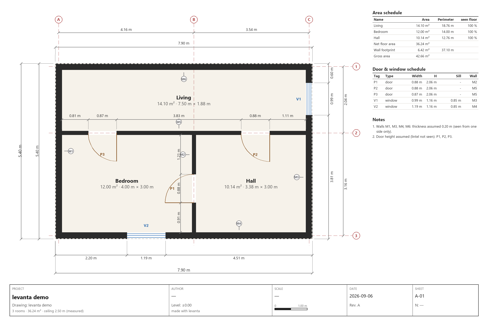
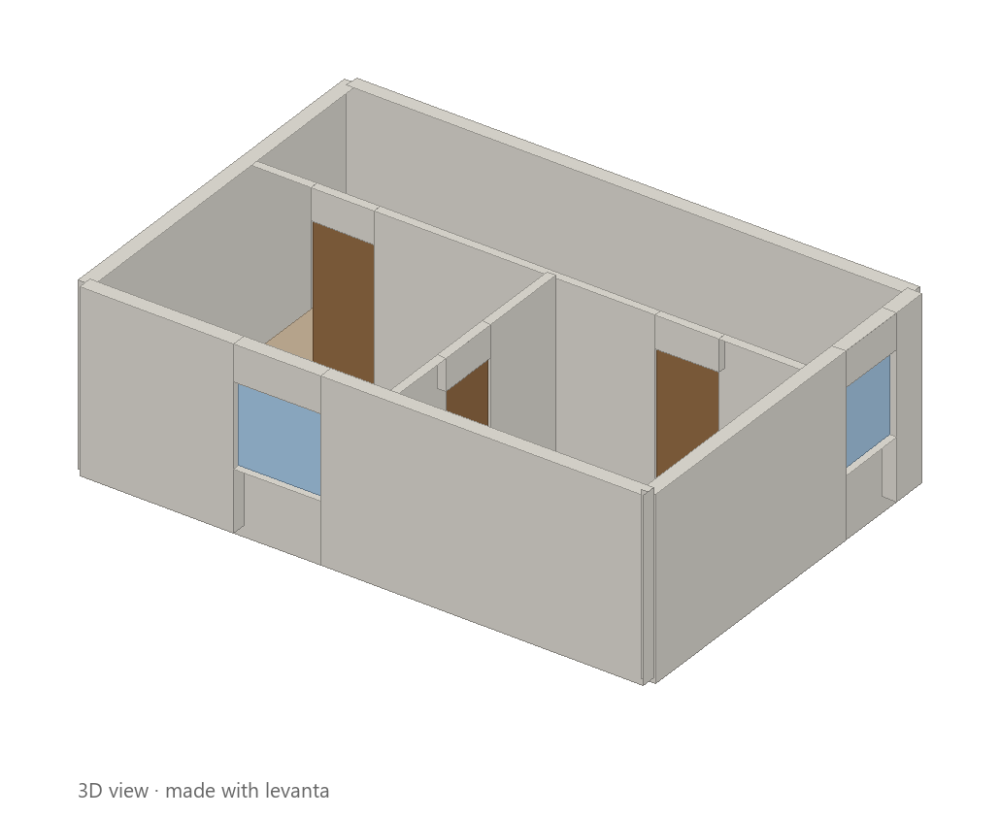
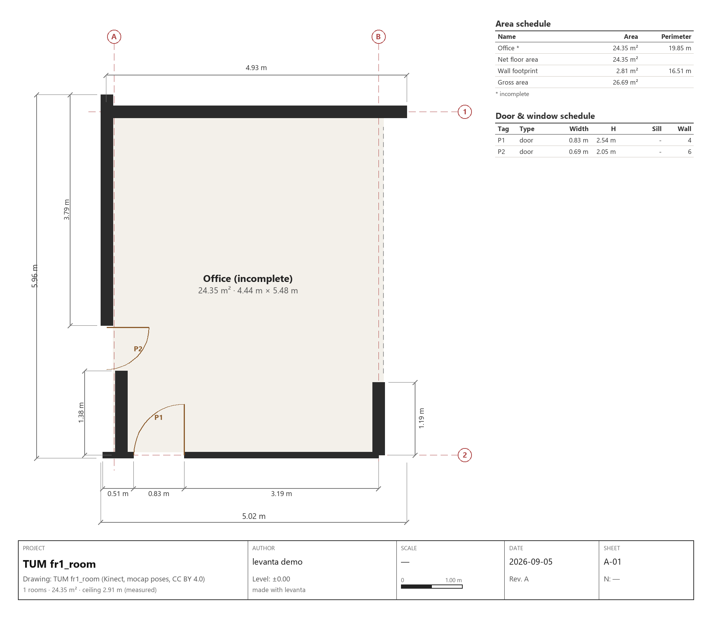
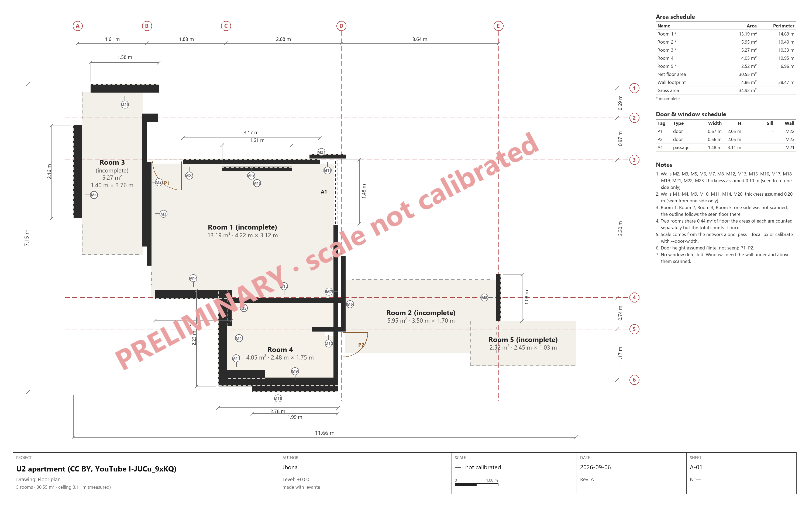

# levanta

**Film your house with your phone, get the floor plan and a 3D model.** Also works from
a point cloud, from RGB-D frames, and, for the outside of any building, from public
map data. A Python library and a command-line tool. MIT: keep the author's notice and
it is yours to use, sell, or build on.

*[Versión en español: README.es.md](README.es.md)*

<p align="center">
  
</p>
<p align="center">
  
</p>

## Try it in ten seconds

```bash
pip install git+https://github.com/EazyHood/levanta
levanta demo --open
```

That builds a small apartment the way a phone would see it, runs the whole pipeline
and opens `plan.html`: the 2D plan, a 3D view you can orbit, and a table with every
measurement. No GPU, no data, no internet needed except for `pip`.

## Then your own house

1. **Film it.** Slowly, landscape, every wall floor to ceiling, through every door. Ten
   minutes of reading [the capture guide](docs/capture-guide.md) save an hour later.
2. **Check the video** before spending GPU time:
   ```bash
   levanta check walk.mp4
   ```
3. **Run it** (needs the GPU extras, see *Install*):
   ```bash
   levanta video walk.mp4 -o out/house --names "Living,Kitchen,Bedroom,Bath" --open
   ```
   Every sharp frame at `--fps` (1 per second by default) goes to the network, 24 at a
   time on an 8 GB card (`--max-views`): a longer walk is reconstructed in chunks that
   share 4 frames (`--overlap`), and each chunk is placed onto the previous one, so a
   three-minute walk is one metric model. `out/house/frames/index.json` lists which
   second each frame came from; title cards and blank frames are skipped.
4. **The scale.** levanta reads which phone filmed the clip from the file itself
   (`levanta check` prints it) and uses that camera's published focal length, which
   removes most of the metric error. Until the plan is calibrated against something
   measured, every sheet carries a diagonal *PRELIMINARY · scale not calibrated* stamp.
   Measure one door and the stamp goes away:
   ```bash
   levanta render out/house/plan.json --door-width 0.90
   ```
   (`--focal-px` if you know the focal length, `--scale 1.07` for a bare factor.)

You get, in `out/house/`: `plan.pdf` (a sheet at 1:50 or 1:100 on A4/A3 with dimension
chains, reference axes, door and window schedule, area schedule and title block, plus a
page of interior elevations) · `plan.html` (viewer with a measuring tool and checks) ·
`plan.png` · `plan.svg` · `plan_3d.png` · `plan_elevations.png` · `plan.dxf` (AIA layers,
blocks, lineweights; m/cm/mm) · `plan_3d.dxf` · `plan.glb` / `plan.obj` (3D) ·
`plan.json` (data) · `plan_debug.png` (what the planner saw).
[What each file is and how to open it.](docs/formats.md)

## What it does, honestly

| Input | What you get | How |
|---|---|---|
| **Phone video** | Metric point cloud, walls with thickness, doors, windows, rooms with areas, ceiling height, 2D plan, 3D model | MapAnything (Meta, 3DV 2026) predicts metric depth and cameras from plain RGB; `levanta.plan` turns the cloud into architecture |
| **RGB-D frames with poses** (ARCore/ARKit/Record3D exports, datasets) | Same, no GPU, exact scale | numpy back-projection |
| **Point cloud** in metres (`.ply`) | Same | `levanta plan` |
| **A latitude/longitude** | Building footprint, height, LOD1 block model, site plan with numbered vertices, a coordinate table (local, WGS84, UTM with zone and EPSG), a boundary table with azimuth and length, area in m² and ha | OpenStreetMap or Overture Maps, both derived from overhead imagery |

### How wrong it is, in numbers

Read this before you use a plan for anything. Everything below is measured against ground
truth (LiDAR meshes, a rendered flat, mocap poses) and reproducible with
`python bench/planner_bench.py`.

| What you scan | What to expect |
|---|---|
| **One room**, walked with a phone | The area comes out **17-31 % small** on five real rooms with LiDAR truth. Walls are found on 33-48 % of the real wall. |
| **A flat with several rooms** | On the only three-room flat measured end to end, levanta found **one room of three** and the area was **43 % small**. Partitions are the failure: on one scene not a single cell of the partition was drawn. |
| **The best case there is** (perfect depth and poses, no network error) | Three rooms of three, but individually **−73 %, +161 % and −28 %**: the total came out +19 % because two errors cancelled. |
| **A room's outline** | Half of it typically rests on floor nobody saw. Each room's sheet now prints that percentage. |

A total that looks right is not evidence that the rooms are right, which is why every sheet
reports the area **per room** and how much of each was observed. The reasoning behind each
number is in [`bench/results/`](bench/results/).

What a satellite **cannot** give you is the interior: no sensor sees through a roof.
`levanta site` therefore stops at footprint + height, and its output says so. Interior
plans come from walking through the house.

## Install

```bash
pip install git+https://github.com/EazyHood/levanta            # plans, 3D, site models (no GPU)
pip install "levanta[overture] @ git+https://github.com/EazyHood/levanta"   # + Overture Maps source
```

For the video path you also need PyTorch with CUDA and MapAnything (Apache-2.0):

```bash
pip install torch torchvision --index-url https://download.pytorch.org/whl/cu128   # pick your CUDA at pytorch.org
pip install -r requirements-recon.txt
levanta doctor                                                                     # tells you what is still missing
```

Python 3.10+. Windows, Linux and macOS for everything except the GPU path, which needs
an NVIDIA GPU with 8 GB or more (24–32 frames) or patience on the CPU. The first video
run downloads 4.6 GB of weights once.

## All commands

```
levanta demo                       see it work on a synthetic apartment
levanta check  walk.mp4            is the video good enough?
levanta video  walk.mp4 -o out     video -> plan + 3D (GPU)
levanta plan   cloud.ply -o out    point cloud -> plan + 3D
levanta tum    <sequence> -o out   public TUM RGB-D sequence -> plan (no GPU)
levanta site   --lat 4.5981 --lon -74.0760 -o out     coordinate -> footprint, height, LOD1
levanta render plan.json           re-make every output after editing the JSON
levanta doctor                     installed / missing / what to type
```

Common options: `--lang es`, `--units ft`, `--names "A,B,C"`, `--title "..."`, `--open`,
`--door-width 0.90`, `--scale 1.07`, `--ceiling`; title block and sheet: `--project`,
`--author`, `--sheet A-01`, `--revision B`, `--level +3.20`, `--north 35`, `--paper A3`,
`--dxf-units cm`. Every command writes a `*_debug.png`.

As a library:

```python
from levanta import PointCloud, extract_floor_plan, PlanOptions
from levanta.io.export import export_all

cloud = PointCloud.load_ply("cloud.ply")               # metres; normals and cameras used when present
result = extract_floor_plan(cloud, PlanOptions())
plan = result.plan.rename_rooms(["Living", "Kitchen"])
plan, factor = plan.calibrated_to_door_width(0.90)     # optional scale fix
export_all(plan, "out", lang="en", units="m")           # html, png, svg, dxf, glb, obj, json
```

## How it works

1. **Reconstruction** (`levanta.recon`). RGB-D frames are back-projected with normals
   computed on the depth image (6-pixel baseline plus a median filter, because consumer
   depth is centimetre-noisy) and oriented towards the camera. For plain video,
   MapAnything predicts per-view metric depth, intrinsics and poses in one pass; those
   views flow through the same code. Every point remembers which camera saw it.
2. **Gravity** (`levanta.plan.gravity`). The mean camera "up" seeds a vertical that is
   sharpened on floor and ceiling normals; a height histogram gives floor and ceiling.
3. **Manhattan frame** (`levanta.plan.walls`). The mode of the wall-normal angles, folded
   to 90°, rotates the cloud so walls run along x and y. `--free` keeps any direction.
4. **Rasters** (`levanta.plan.occupancy`). Per cell, how many height bands contain wall
   points: a wall spans floor to ceiling, a sofa does not. Camera-to-point sight lines
   mark free space: a gap in a wall that rays passed through is a doorway; a gap no ray
   crossed is wall nobody looked at.
5. **Faces → walls.** Per direction, the offset histogram gives wall planes; runs of
   points along each plane give faces; a face seen from the room on the other side is
   paired with it, which *measures* the thickness. Lone faces get a default thickness
   and count as exterior when nothing was seen behind them.
6. **Openings.** Gaps with line of sight become doors (passages if wider than 1.3 m),
   lintel height measured; door and window edges are refined to 1 cm on the raw samples.
   Windows are stretches seen below and above a band but never inside it.
7. **Rooms** (`levanta.plan.rooms`). Doors are bricked up temporarily and the pockets
   between wall bodies become rooms. Gaps up to 1.2 m are bridged; what is still open
   follows the seen floor, loses the bites furniture took out of it, snaps to the walls
   beside it, and is flagged `closed: false`.
8. **Tidying** (`levanta.plan.tidy`). Walls that bound no room (seen through a doorway)
   are set aside, walls are trimmed to the stretch that bounds a room, desk fronts and
   jamb returns standing inside a room are dropped, and a gap between two wall pieces
   that the camera looked through becomes a door.
9. **Sheets and 3D** (`levanta.io`). One drawing model renders SVG, PNG and a vector PDF,
   so they always match. The sheet carries what a drafter expects: dimension chains on
   the perimeter walls, overall dimensions, reference axes, north arrow, opening tags,
   area and opening schedules, title block, and a second page of interior elevations.
   Walls become boxes split around openings (sill and lintel boxes, no booleans); the 3D
   preview is an axonometric projection drawn without OpenGL; the DXF uses AIA-style
   layers, blocks for doors and windows, lineweights and dimension entities.
10. **Checks** (`FloorPlan.quality`). Open rooms, assumed thicknesses, default ceiling,
   uncalibrated video scale and assumed door heights are listed on the console and in
   the viewer, and every table says *measured* or *assumed* per item.

## How we know it works

The tests build apartments with exact ground truth (`levanta.synthetic`): noisy wall,
floor and ceiling samples, low furniture, cameras that see through doorways, a tilted
and rotated copy. The acceptance thresholds were written before the first run.

| Quantity | Ground truth | Measured | Threshold |
|---|---|---|---|
| Room area IoU (5 rooms, 2 scenes) | 1.0 | ≥ 0.999 | ≥ 0.90 |
| Interior wall thickness | 0.120 m | 0.119 m | ± 0.03 m |
| Door widths (4 doors) | 0.90 m | 0.87–0.89 m | ± 0.20 m |
| Window widths / sill / head | 1.20, 1.40 m / 0.90 / 2.10 | 1.19, 1.39 m / 0.85 / 2.10 | ± 0.20 / ± 0.10 m |
| Ceiling height | 2.50 m | 2.4998 m | ± 0.03 m |
| Manhattan residual after 23° yaw + 9° tilt | 0° | < 0.1° | < 1° |

**Real data**, TUM `freiburg1_room` (a hand-held Kinect walked around a cluttered office,
motion-capture poses, 454 frames, no GPU): three walls, two doors (0.83 m with its lintel
measured at 2.54 m, and 0.69 m found as a gap the camera looked through) and the ceiling
(2.91 m); the room comes out 4.44 × 5.48 m. The fourth wall is glass and never returned
depth, so that side is drawn dashed and the room is flagged incomplete. Walls seen
through the doors into the corridor, and the desk fronts standing in front of the walls,
are set aside (`extra_walls` in the JSON) instead of cluttering the plan. See
[`examples/tum_fr1_room/`](examples/tum_fr1_room/).

<p align="center">
  
</p>

**A real phone video**, a CC BY apartment tour from YouTube (U2APARTMENT, East Flatbush
one-bedroom in a prewar building, 1080p, 220 s; attribution in
[`examples/video_u2apartment/ATTRIBUTION.md`](examples/video_u2apartment/ATTRIBUTION.md)).
It is a produced real-estate tour, with title cards, cuts and fast pans, so it is the hard
case, not the showcase:

| | |
|---|---|
| `levanta check` | 221 windows at 1 fps: 151 usable, 31 blurry, 39 title cards or blank |
| frames to the network | 170, covering 1–182 s, in 9 chunks of 24 (4 shared), 225 s on the RTX 5060 |
| points | 974 319 from 170 views (median 3 665 per view); 1 view was a flat picture and was skipped |
| plan | 23 walls, 5 rooms (30.99 m², four of them flagged incomplete), 2 doors + 1 passage, ceiling 3.11 m measured |
| scale | from the network alone: the two doors come out 0.67 and 0.56 m, so `--door-width 0.80` would scale it up by 1.2–1.4; the ceiling (3.11 m) says the scale is about right. Both are on the sheet; neither is verified. |

Before the fixes this video produced *one* wall: 24 frames spread over 220 s had six
title cards among them (text on black is the sharpest thing in the clip), the intro
graphic came back as a plane 0.6 m in front of the camera, and the room views were 1–5 m
apart, too far for the network to register (1–21 points per view). See
[`examples/video_u2apartment/`](examples/video_u2apartment/) for the sheet, the plan
JSON and the diagnostic image.

<p align="center">
  
</p>

**Against ground truth: ARKitScenes.** Five validation scenes from Apple's
[ARKitScenes](https://github.com/apple/ARKitScenes): real iPhone videos (1920×1440, 60 fps,
46–188 s) with the LiDAR mesh and the ARKit trajectory. The truth is the floor polygon of
the mesh; levanta's cameras are fitted to ARKit's with a similarity, so the fitted scale
*is* the scale error. Metrics fixed before the first run; script, method and the full
notes in [`bench/`](bench/results/arkitscenes_2026-09-05.md).

Two rounds, measured the same way; "before" is the first run, "after" is what the numbers
ordered (chunk scale taken from the shared depth maps, outlines that reach the walls, a
stamp when the reconstruction broke). Scale from the network alone:

| scene | truth floor / rooms | scale before → after | area error before → after | floor IoU before → after | camera RMS before → after | rooms | flagged |
|---|---|---|---|---|---|---|---|
| 41069021 | 17.5 m² / 1 | 1.00 → **1.03** | −22 % → **−25 %** | 0.61 → **0.65** | 0.42 → **0.47** m | 1 (1) | no |
| 42897526 | 4.9 m² / 1 | 0.95 → **1.00** | +31 % → **+8 %** | 0.52 → **0.48** | 0.49 → **0.49** m | 1 (1) | no |
| 45260905 | 25.3 m² / 1 | 1.30 → **1.31** | −24 % → **−28 %** | 0.69 → **0.69** | 0.61 → **0.59** m | 1 (1) | no |
| 47331964 | 24.0 m² / 2 | 0.97 → **0.90** | −44 % → **−9 %** | 0.40 → **0.46** | 0.88 → **0.82** m | 3 (2) | no |
| 47430051 | 4.2 m² / 1 | 0.26 → **0.25** | +78 % → **+12 %** | 0.07 → **0.06** | 0.75 → **0.75** m | 1 (1) | **yes** |

What it says, the good and the bad. The network's scale is within 5 % on three of five
rooms and 30 % short on one; giving it the exact focal length ("with K", in the notes)
moved the scale by at most 7 % and not towards the truth, so the PRELIMINARY stamp stays
until a door is measured. Two rooms now come out within 10 % of the LiDAR floor
(−44 % → −9 %, +31 % → +8 %); the two that stay 25 % short are floor the camera never
went near. The bathroom whose reconstruction fell apart (mirror, tiles: 5 % of each frame
kept) is stamped *NOT RECONSTRUCTIBLE* instead of drawn. The camera track still drifts
0.5–0.8 m: consecutive chunks now agree in scale within 14 %, but each chunk's own
geometry fits ARKit's cameras only to 0.1–0.6 m, and no pose graph straightens a chunk.
The largest scene the dataset has (35 m², a 301 s walk, 15 chunks) did not survive that
chaining and is flagged; no ARKitScenes video is an apartment (one video is one room),
and the notes say which public source would give one. Full tables, both rounds, in
[`bench/results/`](bench/results/arkitscenes_2026-09-05_round4.md).

**An apartment: Replica.** No ARKitScenes video is a flat (one video is one room), so the
apartment test is a real scanned flat from Meta's
[Replica](https://github.com/facebookresearch/Replica-Dataset) walked virtually:
`apartment_0`, 51.8 m² of floor, three rooms joined by two doorways, a 116-step walk
rendered off-screen at 720p and handed to `levanta video` as a 1 fps clip
([`bench/replica.py`](bench/replica.py); truth, walk and metrics fixed before running).

| | scale | camera RMS | rooms found | walls | total area error |
|---|---|---|---|---|---|
| scale from the network alone | 1.07 | 1.08 m | 1 of 3 | 5 | −49 % |
| with the exact focal length | 1.06 | 1.04 m | 2 of 3 | 8 | −38 % |

**levanta does not yet deliver its promise on an apartment.** Three rooms come out as one
or two, no doorway is found where there are two, and the room that does match a real one
is 94 % too big: two rooms fused into one. The scale is the good news — 1.06–1.07 with no
calibration at all, the best of any real input so far. What stops the plan is the camera
track: **1.0 m off after a 35 m walk in five chunks**, so each chunk's walls arrive
doubled and offset from the next one's.

That drift is **not a pose problem**, which took three failed attempts and one decisive
measurement to establish. The failures: the ceiling as a scale anchor lost on 5 of 5
scenes (real ceilings run 2.34–3.25 m and the network's own measurement is off by up to
20 %); refining each chunk's poses against its own fused surface (TSDF + ICP) moved the
per-chunk error by ±0.03 m; composing chunks by overlap rather than time left the RMS at
1.01–1.05 m. The measurement: on the rendered walk, where the true pose of every frame and
the true depth of every pixel are known, handing the network the **exact poses** still
gives one room of three and −43 % area, while a **perfect cloud** gives three rooms and
+19 %. What the network gets wrong is the scale of its depth: the shape is good to 6 %,
but the scale is half the truth and swings by a factor of two between views (0.37 to 0.70).

And half of the error above is the planner, not the network: on that same perfect cloud it
turns 29 % of the wall it can see into walls. A seven-scene planner bench that needs no GPU
runs it all: [`bench/results/`](bench/results/round6_2026-09-06.md).

**MapAnything from RGB only** on the same sequence (16 frames of 640×480, RTX 5060 laptop
8 GB, 6.7 GB VRAM, 46 s once the weights are cached), compared pixel by pixel with the
Kinect depth:

| Inputs to the network | median predicted / Kinect depth | abs-rel depth error |
|---|---|---|
| images only | 0.86 | 0.14 |
| images + known intrinsics | **0.93** | **0.095** |

So the scale from video alone is 7–14 % short. That is what `--focal-px` and
`--door-width` are for. Twenty frames of a 640×480 Kinect stream are a hard case for
the planner (two walls and an open room); a phone at 1080p with 30+ frames is the
intended input.

## Limits you should know

- **Scale from video** is only as good as the network's metric estimate: pass the focal
  length or calibrate on a door. RGB-D with device poses is exact.
- **Tall furniture looks like a wall.** Wardrobes, fridges and open door leaves reach high
  enough to pass the height test. Scan with doors closed; delete the extra wall in the
  JSON and `levanta render`.
- **Unseen is unknown.** Thickness is measured only where both faces were scanned;
  otherwise a default is used (`sides_seen: 1`). Rooms with an unscanned side are
  drawn dashed there and labelled *incomplete*, never invented.
- **Manhattan mode** snaps walls to two directions; `--free` for angled walls.
- **Site models are LOD1**: footprint × height. Height comes from the source's `height`
  tag when present, else `levels × 3 m`, else 3 m, and the JSON says which.
- **A partition may simply not be drawn**, and then the second room cannot exist: this is
  measured, not hypothetical, and it is the main reason a flat comes out as one room.
- **Half the interior can be inferred rather than seen.** A camera at eye height sees
  furniture, not floor: on a walk that passed within 2 m of 80-94 % of every room, floor
  points reached only 36 % of the floor. The sheet prints the share per room.
- Glass, mirrors and blank walls are hard for any photogrammetry.

More in the [FAQ](docs/faq.md).

## Data and licenses used

- [MapAnything](https://github.com/facebookresearch/map-anything), Apache-2.0 code; the
  default checkpoint `facebook/map-anything-apache` is Apache-2.0 too.
- [TUM RGB-D benchmark](https://cvg.cit.tum.de/data/datasets/rgbd-dataset), CC BY 4.0
  (Sturm et al., IROS 2012). Not redistributed; `levanta tum` reads a downloaded sequence.
- [OpenStreetMap](https://www.openstreetmap.org) via Overpass, ODbL 1.0,
  © OpenStreetMap contributors. [Overture Maps](https://overturemaps.org), ODbL /
  CDLA-Permissive-2.0 per source.
- The HTML viewer loads [three.js](https://threejs.org) (MIT) from a CDN for the
  interactive 3D view; everything else is embedded in the file.

## Project layout

```
src/levanta/
  scene.py, geometry.py    Camera, Frame, PointCloud; numeric helpers
  synthetic.py             ground-truth apartments (tests and `levanta demo`)
  i18n.py                  labels in English and Spanish, metres or feet
  io/                      video frames + quality check, TUM loader, drawing model (SVG+PNG),
                           2D plan, axonometric 3D, HTML viewer, DXF/GLB/OBJ/JSON writers
  recon/                   RGB-D back-projection, MapAnything adapter
  plan/                    gravity, rasters, walls, rooms and openings, pipeline, 3D model, debug PNG
  site/                    WGS84 projection, OSM/Overture sources, LOD1 model + site plan
  cli.py                   the `levanta` command
tests/                     ground-truth scenes, unit tests, CLI tests (no GPU, no network)
docs/                      capture guide, FAQ, formats (English and Spanish)
examples/                  outputs you can open without running anything
```

## License and attribution

MIT, see [LICENSE](LICENSE). Copyright (c) 2026 Jhona (github.com/EazyHood). Use it,
copy it, modify it, sell it: just keep the copyright notice and the permission notice
with it. A citation ([CITATION.cff](CITATION.cff)) is appreciated in published work.
